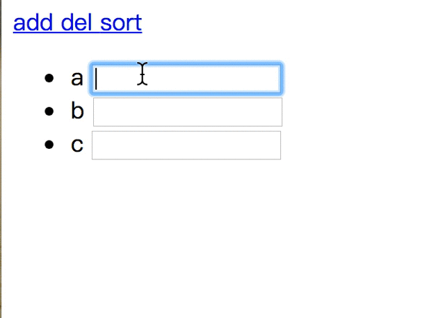

# React之key详解

## 先看例子

上面例子中的input组件渲染的代码如下所示

    {this.state.data.map((v,idx)=><Item key={idx} v={v} />)}

    //Item组件render方法
    render(){
       return <li>{this.props.v} <input type="text"/></li>
    }

首先说明的是，若页面中数组内容是固定而不是动态的话，上面的代码也不会有什么问题(｡•ˇ‸ˇ•｡ 但是如此这也是不是推荐的做法)。

但是，动态数组导致其渲染的组件就会有问题，从上面图中你也能看出问题：数组动态改变后，页面上input的输入内容跟对应的数组元素顺序不对应。

为什么呢？我们先来看下React的key

- - -
# react key概述
key的作用

react中的key属性，它是一个特殊的属性，它是出现不是给开发者用的（例如你为一个组件设置key之后不能获取组件的这个key props），而是给react自己用的。

简单来说，react利用key来识别组件，它是一种身份标识标识，就像我们的身份证用来辨识一个人一样。每个key对应一个组件，相同的key react认为是同一个组件，这样后续相同的key对应组件都不会被创建。例如下面代码：

    //this.state.users内容
    this.state = {
     users: [{id:1,name: '张三'}, {id:2, name: '李四'}, {id: 2, name: "王五"}],
     ....//省略
    }
    render()
     return(
      

        <h3>用户列表</h3>
        {this.state.users.map(u => 
{u.id}:{u.name}
)}
      

     )
    );

上面代码在dom渲染挂载后，用户列表只有张三和李四两个用户，王五并没有展示处理，主要是因为react根据key认为李四和王五是同一个组件，
导致第一个被渲染，后续的会被丢弃掉。

这样，有了key属性后，就可以与组件建立了一种对应关系，react根据key来决定是销毁重新创建组件还是更新组件。

- key相同，若组件属性有所变化，则react只更新组件对应的属性；没有变化则不更新。
- key值不同，则react先销毁该组件(有状态组件的componentWillUnmount会执行)，然后重新创建该组件
（有状态组件的constructor和componentWillUnmount都会执行）

> 另外需要指明的是:  key不是用来提升react的性能的，不过用好key对性能是有帮组的。

- - -
## key的使用场景

在项目开发中，key属性的使用场景最多的还是由数组动态创建的子组件的情况，需要为每个子组件添加唯一的key属性值。

那么，为何由数组动态创建的组件必须要用到key属性呢？这跟数组元素的动态性有关。

拿上述用户列表的例子来说，看一下babel对上述代码的转换情况：

    // 转换前
    const element = (
      

        <h3>用户列表</h3>
        {[
1:张三
, 
2:李四
]}
      

    );

    // 转换后
    "use strict";

    var element = React.createElement(
      "div",
      null,
      React.createElement("h3",null,"用户列表"),
      [
        React.createElement("div",{ key: 1 },"1:张三"), 
        React.createElement("div",{ key: 2 },"2:李四")
      ]
    );

有babel转换后React.createElement中的代码可以看出，其它元素之所以不是必须需要key是因为不管组件的state或者props如何变化，这些元素始终占据着React.createElement固定的位置，这个位置就是天然的key。

而由数组创建的组件可能由于动态的操作导致重新渲染时，子组件的位置发生了变化，例如上面用户列表子组件新增一个用户，
上面两个用户的位置可能变化为下面这样：

    var element = React.createElement(
      "div",
      null,
      React.createElement("h3",null,"用户列表"),
      [
        React.createElement("div",{ key: 3 },"1:王五"), 
        React.createElement("div",{ key: 1 },"2:张三"), 
        React.createElement("div",{ key: 2 },"3:李四")
      ]
    );

可以看出，数组创建子组件的位置并不固定，动态改变的；这样有了key属性后，react就可以根据key值来判断是否为同一组件。

另外，还有一种比较常见的场景：为一个有复杂繁琐逻辑的组件添加key后，后续操作可以改变该组件的key属性值，从而达到先销毁之前的组件，再重新创建该组件。

- - -
# key的最佳实践
上面说到了，由数组创建的子组件必须有key属性，否则的话你可能见到下面这样的warning：

    Warning: Each child in an array or iterator should have a unique "key" prop. Check the render method of `ServiceInfo`. See `https://fb.me/react-warning-keys` for more information.
    
可能你会发现，这只是warning而不是error，它不是强制性的，为什么react不强制要求用key而报error呢？其实是强制要求的，
只不过react为按要求来默认上帮我们做了，它是以数组的index作为key的。

- - -
##v index作为key是一种反模式
在list数组中，用key来标识数组创建子组件时，若数组的内容只是作为纯展示，而不涉及到数组的动态变更，其实是可以使用index作为key的。

但是，若涉及到数组的动态变更，例如数组新增元素、删除元素或者重新排序等，这时index作为key会导致展示错误的数据。本文开始引入的例子就是最好的证明。

    {this.state.data.map((v,idx)=><Item key={idx} v={v} />)}
    // 开始时：['a','b','c']=>
    <ul>
        <li key="0">a <input type="text"/></li>
        <li key="1">b <input type="text"/></li>
        <li key="2">c <input type="text"/></li>
    </ul>

    // 数组重排 -> ['c','b','a'] =>
    <ul>
        <li key="0">c <input type="text"/></li>
        <li key="1">b <input type="text"/></li>
        <li key="2">a <input type="text"/></li>
    </ul>

上面实例中在数组重新排序后，key对应的实例都没有销毁，而是重新更新。具体更新过程我们拿key=0的元素来说明， 数组重新排序后：

- 组件重新render得到新的虚拟dom；
- 新老两个虚拟dom进行diff，新老版的都有key=0的组件，react认为同一个组件，则只可能更新组件；
- 然后比较其children，发现内容的文本内容不同（由a--->c)，而input组件并没有变化，这时触发组件的componentWillReceiveProps方法，
从而更新其子组件文本内容;
- 因为组件的children中input组件没有变化，其又与父组件传入的任props没有关联，所以input组件不会更新
(即其componentWillReceiveProps方法不会被执行)，导致用户输入的值不会变化。

这就是index作为key存在的问题，所以不要使用index作为key。

- - -
## key的值要稳定唯一
在数组中生成的每项都要有key属性，并且key的值是一个永久且唯一的值，即稳定唯一。

在理想情况下，在循环一个对象数组时，数组的每一项都会有用于区分其他项的一个键值，相当数据库中主键。这样就可以用该属性值作为key值。
但是一般情况下可能是没有这个属性值的，这时就需要我们自己保证。

但是，需要指出的一点是，我们在保证数组每项的唯一的标识时，还需要保证其值的稳定性，不能经常改变。例如下面代码：

    {
        this.state.data.map(el=><MyComponent key={Math.random()}/>)
    }
    
上面代码中中MyComponent的key值是用Math.random随机生成的，虽然能够保持其唯一性，但是它的值是随机而不是稳定的，
在数组动态改变时会导致数组元素中的每项都重新销毁然后重新创建，有一定的性能开销；另外可能导致一些意想不到的问题出现。所以：

> key的值要保持稳定且唯一，不能使用random来生成key的值。

所以，在不能使用random随机生成key时，我们可以像下面这样用一个全局的localCounter变量来添加稳定唯一的key值。

    var localCounter = 1;
    this.data.forEach(el=>{
        el.id = localCounter++;
    });
    //向数组中动态添加元素时，
    function createUser(user) {
        return {
            ...user,
            id: localCounter++
        }
    }

- - -
## key其它注意事项
- key属性是添加到自定义的子组件上，而不是子组件内部的顶层的组件上。

      //error
      render() {
          

            {{item.name}}
          

      }

      //right
      <MyComponent key={{item.key}}/> 

- key值的唯一是有范围的，即在数组生成的同级同类型的组件上要保持唯一，而不是所有组件的key都要保持唯一

- 不仅仅在数组生成组件上，其他地方也可以使用key，主要是react利用key来区分组件的，相同的key表示同一个组件，
react不会重新销毁创建组件实例，只可能更新；key不同，react会销毁已有的组件实例，重新创建组件新的实例。

      {
        this.state.type ? 
          
<Son_1/><Son_2/>

          : 
<Son_2/><Son_1/>

      }
    
例如上面代码中，this.state.type的值改变时，原Son_1和Son2组件的实例都将会被销毁，并重新创建Son_1和Son_2组件新的实例，
不能继承原来的状态，其实他们只是互换了位置。为了避免这种问题，我们可以给组件加上key。

    {
      this.state.type ? 
        
<Son_1 key="1"/><Son_2 key="2"/>

        : 
<Son_2 key="2" /><Son_1 key="1"/>

    }
    
这样，this.state.type的值改变时，Son_1和Son2组件的实例没有重新创建，react只是将他们互换位置。

- - -
# OVER

